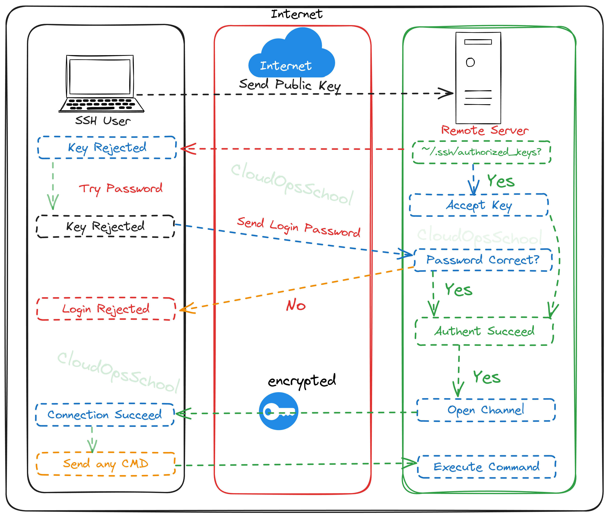

### Table of Contents 

*   [SSH Overview](#ssh-and-how-ssh-works)
    * [SSH (Secure Shell)](#ssh-secure-shell)
    * [Key Features of SSH](#key_features)
*   [SSH Architecture](#ssh-architecture)
*   [SSH Authentication](#ssh-authentication)
*   [SSH Server Installation](#ssh-server-Installation)
*   [Configure SSH for Password-Based Authentication](#configure-ssh-for-password-based-authentication)
*   [Configure SSH for Key-Based Authentication](#configure-ssh-for-key-based-authentication)
*   [Manage SSH services](#manage-ssh)
*   [SSH #known_hosts](#ssh-known-hosts)
*   [SSH Client Configuration](#ssh-client-configuration)

## SSH Overview <a name="ssh-and-how-ssh-works"></a>
***SSH (Secure Shell)*** <a name="ssh-secure-shell"></a> 
: is a network protocol that provides a secure channel over an unsecured network by encrypting the data transmitted between the client and the server. It's widely used by system administrators to manage servers remotely, and by developers to access their servers and deploy code.

***Key Features of SSH*** <a name="key_features"></a>
- ***Encryption:*** SSH encrypts all communication between the client and the server, preventing eavesdropping and tampering.   
- ***Authentication:*** SSH provides strong authentication mechanisms to verify the identity of both the client and the server.   
- ***Port forwarding:*** SSH can be used to create secure tunnels for other network protocols.

## SSH Architecture <a name="ssh-architecture"></a> 
SSH relies on the public-key cryptography to authenticate the remote system and allow it to authenticate the user trying to connect on it. SSH works on three hierarchical layers:

- ***Transport layer:*** provides the server authentication, confidentiality and integrity, it also exposes the reserved port 22 used by default for the protocol
- ***User authentication protocol:*** validates if the user is known by the server and the credentials are correct by testing a suite of user-authentication algorithms
- ***Connection protocol:*** multiplexes the encrypted client server communication tunnel into several logical communication channels


## SSH Connection Process (Detailed Steps)

1.  **TCP Connection:** The client initiates a TCP connection to the SSH server on port 22.
2.  **TCP Handshake:** The server responds, establishing a TCP handshake.
3.  **Identification String Exchange:** The server and client exchange identification strings containing protocol version and other information.
4.  **Server Public Key Exchange:** The server sends its public key to the client.
5.  **Host Key Verification:**
    *   The client checks if the server's public key is present in its `known_hosts` file.
    *   If not found, the client prompts the user to verify the server's fingerprint. If the user accepts, the server's key is added to `known_hosts`.
    *   If the key doesn't match an existing entry in `known_hosts`, a warning is displayed, indicating a potential man-in-the-middle attack.
6.  **Session Key Generation and Encryption:** The client generates a random session key and encrypts it using the server's public key.
7.  **Session Key Decryption:** The server decrypts the session key using its private key.
8.  **Encrypted Communication:** All subsequent communication is encrypted using the shared session key, establishing a secure channel.

## SSH Authentication <a name="ssh-authentication"></a>
SSH (Secure Shell) authentication is a mechanism used to securely verify the identity of users or systems connecting to a remote machine via the SSH protocol. The process ensures that only authorized entities gain access to the server and its resources. 

**Authentication Methods** <br>
SSH supports several authentication methods, but the two most common are:

*   Password-based authentication:
    - The client sends a username and password to the server.
    - The server checks the credentials against its authentication database (e.g., /etc/passwd or LDAP)
*   Key-based authentication: The user uses a cryptographic key pair (a private key and a public key) for authentication.
    - The client generates a key pair:
      - Private Key: Stored securely on the client.
      - Public Key: Copied to the server and stored in ~/.ssh/authorized_keys.
    - During authentication, the server validates the client by challenging the private key.
 
**Authentication Process Workflow**

* Connection Initialization:
    - The client initiates an SSH session with the server.
    - The server responds with its host key, and the client verifies it.
* Secure Channel Establishment:
    - A secure encrypted channel is created using the SSH transport layer.
* Authentication:
    - The server prompts the client for authentication.
    - The client submits credentials (e.g., password, key, or token).
    - The server validates the credentials against its authentication mechanism.
* Session Establishment:
    - Upon successful authentication, the server grants access, and the session begins.



## SSH Server Installation <a name="ssh-server-installation"></a>

**Step 1:** First, make sure your system is up to date: `sudo apt-get update`

**Step 2:** Install the OpenSSH server package: `sudo apt-get install openssh-server`

**Step 3:** Verify that the SSH service is running: `sudo systemctl status ssh.service`
*    If it’s not active, start it: `sudo systemctl start ssh.service`
*    Enable it to start on boot: `sudo systemctl enable ssh.service`

## Configure SSH for Password-Based Authentication <a name="configure-ssh-for-password-based-authentication"><a/>

**Step 1: Backup the Configuration File**: It's always a good practice to create a backup of the existing configuration file: `sudo cp /etc/ssh/sshd_config /etc/ssh/sshd_config.bak`

**Step 2: Edit the SSH Configuration File**: Open the SSH configuration file to customize settings:`sudo vim /etc/ssh/sshd_config`

**Step 3** Ensure the following settings are configured:
```
Port 2222                   # Use a non-standard port to reduce exposure to automated scans.
PasswordAuthentication yes
PermitRootLogin no          # Prevent direct root login for security reasons.
PermitEmptyPasswords no     # Prevent login for accounts with empty passwords.
ClientAliveInterval 300     # Detect and terminate idle SSH sessions to prevent resource hogging or security risks.
ClientAliveCountMax 3       # Detect and terminate idle SSH sessions to prevent resource hogging or security risks.
AllowUsers username         # Optional: Restrict SSH access to specific users or groups to limit exposure
AllowGroups sshusers        # Optional: Restrict SSH access to specific users or groups to limit exposure
MaxAuthTries 3              # Limit the number of failed authentication attempts to prevent brute force attacks
```
**Step 5: Test the configuration**: for any further errors before reloading the service: `sudo /usr/sbin/sshd -t`

**Step 4: Restart Service**: Restart the SSH service to apply changes: `sudo systemctl restart ssh.service`

**Step 5: login Test:** On the client machine, connect using: `ssh -p 2222 username@server_ip`


## Configure SSH for Key-Based Authentication <a name="configure-ssh-for-key-based-authentication"><a/>

**On the Server**

***Step 1: Backup the SSH Configuration File*** <br>
It's always a good practice to create a backup of the existing configuration file:`sudo cp /etc/ssh/sshd_config /etc/ssh/sshd_config.bak`

***Step 2***: Edit the SSH configuration file: `sudo vim /etc/ssh/sshd_config`

***Step 3***: Modify the following settings: 
```
Port 2222                   # Use a non-standard port to reduce exposure to automated scans.
PubkeyAuthentication yes
PasswordAuthentication no   # Disable password login for security
PermitRootLogin no          # Prevent direct root login for security reasons.
ClientAliveInterval 300     # Detect and terminate idle SSH sessions to prevent resource hogging or security risks.
ClientAliveCountMax 3       # Detect and terminate idle SSH sessions to prevent resource hogging or security risks.
Protocol 2                  # Optional: Specifies the SSH protocol version. SSH protocol version 2 is more secure and is the default in modern systems.
AllowUsers username         # Optional: Restrict SSH access to specific users or groups to limit exposure
AllowGroups sshusers        # Optional: Restrict SSH access to specific users or groups to limit exposure
MaxAuthTries 3              # Limit the number of failed authentication attempts to prevent brute force attacks

 
```
***Step 4: Test the configuration***: for any further errors before reloading the service: `sudo /usr/sbin/sshd -t`

***Step 5: Restart Service***: Restart the SSH service to apply changes: `sudo systemctl restart ssh.service`

**On the Client**

***Step 1***: Generate an SSH key pair: `ssh-keygen -t rsa -b 4096 -C "your_email@example.com"`
*    Press `Enter` to accept the default file location `~/.ssh/id_rsa`.
*    Optionally, set a passphrase for the private key.
*    To check the genarated key: `ll ~/.ssh`

***Step 2***: Copy the public key to the server: `ssh-copy-id username@server_ip` (Enter the password for the user when prompted)
   - Alternatively, manually copy the public key: `cat ~/.ssh/id_rsa.pub | ssh username@server_ip "mkdir -p ~/.ssh && cat >> ~/.ssh/authorized_keys && chmod 600 ~/.ssh/authorized_keys"`

***Step 3: login Test***: On the client machine, connect using: `ssh -p 2222 username@server_ip`

**Additional Security Enhancements**
  
* Set up a firewall to allow SSH:
```
sudo ufw allow 22/tcp   # If using the default port
sudo ufw enable
sudo ufw status
```
* Fail2ban: Install Fail2ban to protect against brute-force attacks `sudo apt-get install fail2ban`


## Manage SSH services <a name="manage-ssh"></a> 

Systemd (used by most modern Linux distributions such as Ubuntu, Debian, Fedora, and CentOS 7+) provides the following fundamental commands for controlling the SSH server.
  - Start: `sudo systemctl start ssh.service`
  - Stop: `sudo systemctl stop ssh.service`
  - Restart: `sudo systemctl restart ssh.service`
  - Reload: `sudo systemctl reload ssh.service`
  - Status: `sudo systemctl status ssh.service` (This shows whether the service is running, any recent logs, etc.)
  - Enable on boot: `sudo systemctl enable ssh.service` (This ensures SSH starts automatically when the system boots)
  - Disable on boot: `sudo systemctl disable ssh.service` (This prevents SSH from starting automatically)

## SSH #known_hosts <a name="ssh-known-hosts"></a>

The `known_hosts` file is a crucial part of SSH security. It stores the public keys of SSH servers you've connected to, helping prevent man-in-the-middle (MITM) attacks.

***What is `known_hosts`?***

*   **Purpose:** Stores server public keys for verification on subsequent connections.
*   **Location:** Typically `~/.ssh/known_hosts` (user-specific) or `/etc/ssh/ssh_known_hosts` (system-wide).
*   **Functionality:** On the first connection, you're prompted to verify the server's key. Upon confirmation, the key is stored in `known_hosts`. Subsequent connections compare the server's key with the stored key. A mismatch triggers a warning.

***Key Formats in `known_hosts`***

Each line in `known_hosts` represents a known host and its key, generally in this format:

`[hostname]:port keytype base64-encoded-key`

*   **`[hostname]:port`:** The server's hostname or IP address and port number (e.g., `[example.com]:22`, `[192.168.1.100]:2222`).
*   **`keytype`:** The key exchange algorithm (e.g., `ssh-rsa`, `ssh-ed25519`, `ecdsa-sha2-nistp256`).
*   **`base64-encoded-key`:** The actual public key, encoded in base64.

Example: <br>
<br>
`[server.example.net]:22 ssh-ed25519 AAAAC3NzaC1lZDI1NTE5AAAA...` <br>
`[10.0.0.10]:2222 ssh-rsa AAAAB3NzaC1yc2EAAAADAQABAAABAQC...`

***Clearing `known_hosts` File*** <br>

*   Clearing the entire file requires you to re-verify the keys of all servers you connect to. `rm ~/.ssh/known_hosts`
*   Manual Editing: You can manually edit the known_hosts file with a text editor `sudo vim ~/.ssh/known_hosts`

***Best Practices***

*   Use `ssh-keygen -R` to remove specific host entries.
*   Be cautious when clearing the entire known_hosts file.
*   Always verify host keys when connecting to a server for the first time, ideally through an out-of-band method.
*   Prefer modern key exchange algorithms like `ssh-ed25519` when available.

## SSH Client Configuration <a name="ssh-client-configuration"></a>

SSH client configuration involves setting options that control how your SSH client behaves when connecting to servers. These options can be set globally for all users on a system or on a per-user basis.

**Configuration Files** <br>
*   **Global Configuration:** `/etc/ssh/ssh_config` (affects all users)
*   **Per-User Configuration:** `~/.ssh/config` (affects only the current user; overrides global settings)

**Key Configuration Options** <br>
| Option                 | Description                                                                                                                                                                                                                                                                    | Example                                                                     |
| :--------------------- | :----------------------------------------------------------------------------------------------------------------------------------------------------------------------------------------------------------------------------------------------------------------------------- | :-------------------------------------------------------------------------- |
| `Host`                 | Defines a specific host or group of hosts for which the following options apply. Supports wildcards (`*`, `?`).                                                                                                                                                                  | `Host server1.example.com`, `Host 192.168.1.*`, `Host *.example.net`        |
| `Hostname`             | Specifies the real hostname or IP address of the server.                                                                                                                                                                                                                     | `Hostname server1.example.com`, `Hostname 192.168.1.100`                    |
| `Port`                 | Specifies the port number to connect to (default is 22).                                                                                                                                                                                                                       | `Port 2222`                                                               |
| `User`                 | Specifies the username to use for authentication.                                                                                                                                                                                                                              | `User myuser`                                                             |
| `IdentityFile`         | Specifies the path to the private key file.                                                                                                                                                                                                                                     | `IdentityFile ~/.ssh/id_rsa`, `IdentityFile ~/.ssh/my_special_key`         |
| `IdentitiesOnly`       | If `yes`, only uses explicitly specified `IdentityFile` keys, ignoring SSH agent.                                                                                                                                                                                              | `IdentitiesOnly yes`                                                      |
| `StrictHostKeyChecking` | Controls host key checking: `ask` (default, prompts on first connection or change), `no` (accepts all keys - **INSECURE**), `yes` (strictly checks `known_hosts`).                                                                                                                  | `StrictHostKeyChecking yes`                                                |
| `UserKnownHostsFile`   | Specifies the path to the `known_hosts` file.                                                                                                                                                                                                                                 | `UserKnownHostsFile ~/.ssh/my_known_hosts`                                |
| `ProxyJump`            | Jumps through an intermediate host (e.g., `user@jump_host user@destination_host`).                                                                                                                                                                                               | `ProxyJump user@intermediate_host user@destination_host`                 |
| `ForwardAgent`         | Enables SSH agent forwarding (allows using local keys on the remote server).                                                                                                                                                                                                   | `ForwardAgent yes`                                                        |
| `ServerAliveInterval`  | Sends null packets to keep the connection alive (in seconds).                                                                                                                                                                                                                  | `ServerAliveInterval 60`                                                   |
| `ServerAliveCountMax`  | Number of server alive messages without response before disconnecting.                                                                                                                                                                                                         | `ServerAliveCountMax 3`                                                   |
| `Ciphers`              | Specifies allowed ciphers in order of preference (e.g., `chacha20-poly1305@openssh.com,aes256-gcm@openssh.com`). Use with caution. Consider using defaults unless you have a specific need. Refer to `man ssh_config` for more information.                                          | `Ciphers chacha20-poly1305@openssh.com,aes256-gcm@openssh.com`              |
| `KexAlgorithms`        | Specifies allowed key exchange algorithms (e.g., `curve25519-sha256,diffie-hellman-group-exchange-sha256`). Use with caution. Consider using defaults unless you have a specific need. Refer to `man ssh_config` for more information.                                          | `KexAlgorithms curve25519-sha256,diffie-hellman-group-exchange-sha256` |

**Example `~/.ssh/config` file:**

```
Host server1
    Hostname server1.example.com
    User myuser
    IdentityFile ~/.ssh/id_rsa

Host server2
    Hostname 192.168.1.100
    Port 2222
    User anotheruser
    IdentityFile ~/.ssh/another_key
    StrictHostKeyChecking yes

Host jump_server
    Hostname jump.example.net
    User jumpuser
    IdentityFile ~/.ssh/jump_key

Host internal_server
    Hostname internal.example.local
    User internaluser
    ProxyJump jumpuser@jump.example.net
    IdentityFile ~/.ssh/internal_key
```


