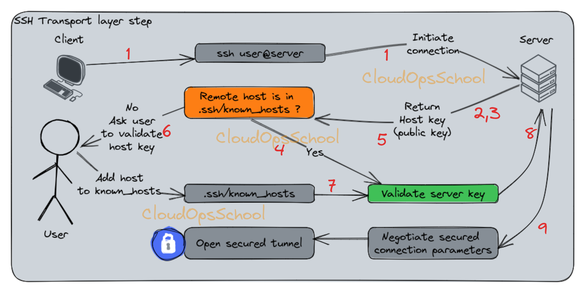

### Table of Contens

*   [SSH and How it Works](#ssh-and-how-ssh-works)
    - [SSH (Secure Shell)](#ssh-(secure-shell):)
*   [SSH Server Configuration](#ssh-server-configuration)
*   [SSH Client Configuration](#ssh-client-configuration)

## SSH and How it Works <a name="ssh-and-how-ssh-works">
### SSH (Secure Shell) <a name="ssh-(secure-shell):"></a> is a network protocol that provides a secure channel over an unsecured network by encrypting the data transmitted between the client and the server. It's widely used by system administrators to manage servers remotely, and by developers to access their servers and deploy code.

***Key Features of SSH***
- ***Encryption:*** SSH encrypts all communication between the client and the server, preventing eavesdropping and tampering.   
- ***Authentication:*** SSH provides strong authentication mechanisms to verify the identity of both the client and the server.   
- ***Port forwarding:*** SSH can be used to create secure tunnels for other network protocols.

***SSH Architecture:***
SSH relies on the public-key cryptography to authenticate the remote system and allow it to authenticate the user trying to connect on it. SSH works on three hierarchical layers:
- ***Transport layer:*** provides the server authentication, confidentiality and integrity, it also exposes the reserved port 22 used by default for the protocol
- ***User authentication protocol:*** validates if the user is known by the server and the credentials are correct by testing a suite of user-authentication algorithms
- ***Connection protocol:*** multiplexes the encrypted client server communication tunnel into several logical communication channels



**Detailed steps:**

1. The client initiates a TCP connection to the SSH server on port 22 (default reserved port).
2. The server responds to the client’s connection and they establish a TCP handshake.
3. The server sends its identification string to the client with various informations (protocol version, etc).
4. The client sends its own identification informations to the server using the same format.
5. Once the identification strings have been exchanged, the server sends its public key to the client.
6. If the server is not in the “known_hosts” file of the client, it will prompt the user if they can trust it or not. If yes, the server will be added into the list.
   - If not, this question will prompted everytime
7. The client generates a random session key and encrypt it with the server’s public key.
8. The server decrypts the session key using its private key.
9. The connection between the client and the server is now secured by encrypting each data using the session key.

## SSH Server Configuration <a name="ssh-server-configuration">
***Step 1: Update Your System -***
First, make sure your system is up to date
```
sudo apt-get update
```
***Step 2: Install OpenSSH Server -***
Install the OpenSSH server package.
```
sudo apt-get install openssh-server
```

***Step 3: Backup and Configure SSH Server***
* ***Backup the SSH Configuration File:*** Before making any changes, it's always a good practice to create a backup of the existing configuration file.
```
sudo cp /etc/ssh/sshd_config /etc/ssh/sshd_config.bak
```
* ***Edit the SSH Configuration File:*** Open the SSH configuration file to customize settings.
```
sudo vim /etc/ssh/sshd_config
```
_Here are some common configurations you might want to adjust:_
  - ***Port:*** Change the default SSH port (default is 22): ``` Port: 2222 ```
  - ***PasswordAuthentication:*** Disable password authentication and use key-based authentication: ```PasswordAuthentication: no```
  - ***PermitEmptyPasswords:*** Prevent login with empty passwords: `PermitEmptyPasswords no`
  - ***PermitRootLogin:*** Control whether root can log in directly: `PermitRootLogin no`
  - ***ClientAliveInterval:*** Set the interval (in seconds) that the server will wait before sending a null packet to keep the connection alive: `ClientAliveInterval 300`
  - ***Protocol:*** Specify the SSH protocol versions supported (default is 2): `Protocol 2`
  - ***AllowUsers:*** Specify which users are allowed to connect: `AllowUsers your_username`


    
***Step 4: Restart SSH Service -***
Restart the SSH service to apply the changes.
```
sudo systemctl restart ssh
```
***Step 5: Enable SSH on Boot -***
Ensure SSH starts automatically on boot
```
sudo systemctl enable ssh
```

***Step 6: Test SSH Connection -***
Test the SSH connection from another machine:
```
ssh -p port_number username@server_ip
```

***Additional Security Measures***
- ***Firewall:*** Ensure your firewall allows SSH traffic:
  ```
  sudo ufw allow 2222/tcp
  ```
  To check the firewall status
  ```
  sudo ufw status
  ```
- ***Fail2ban:*** Install Fail2ban to protect against brute-force attacks:
  ```
  sudo apt-get install fail2ban
  ```

***Manage SSH services :***
Systemd (used by most modern Linux distributions such as Ubuntu, Debian, Fedora, and CentOS 7+) provides the following fundamental commands for controlling the SSH server.
  - Start: `sudo systemctl start ssh`
  - Stop: `sudo systemctl stop ssh`
  - Restart: `sudo systemctl restart ssh`
  - Reload: `sudo systemctl reload ssh`
  - Status: `sudo systemctl status ssh` (This shows whether the service is running, any recent logs, etc.)
  - Enable on boot: `sudo systemctl enable ssh` (This ensures SSH starts automatically when the system boots)
  - Disable on boot: `sudo systemctl disable ssh` (This prevents SSH from starting automatically)

## SSH Client Configuration <a name="ssh-client-configuration">


